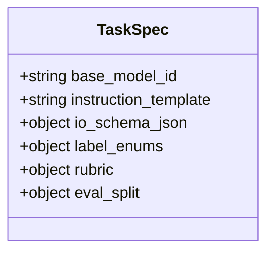
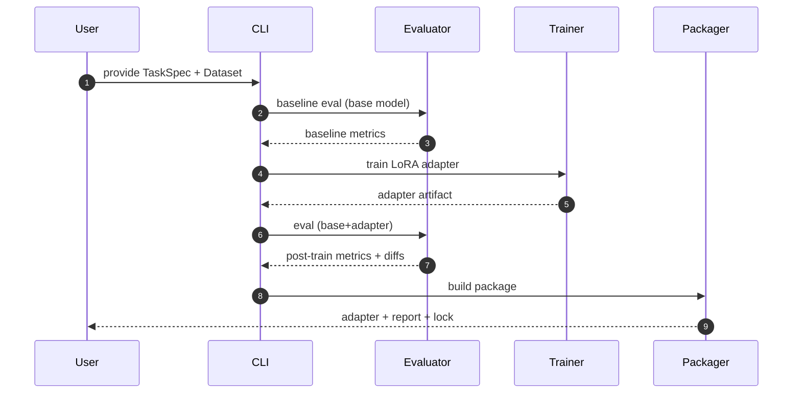
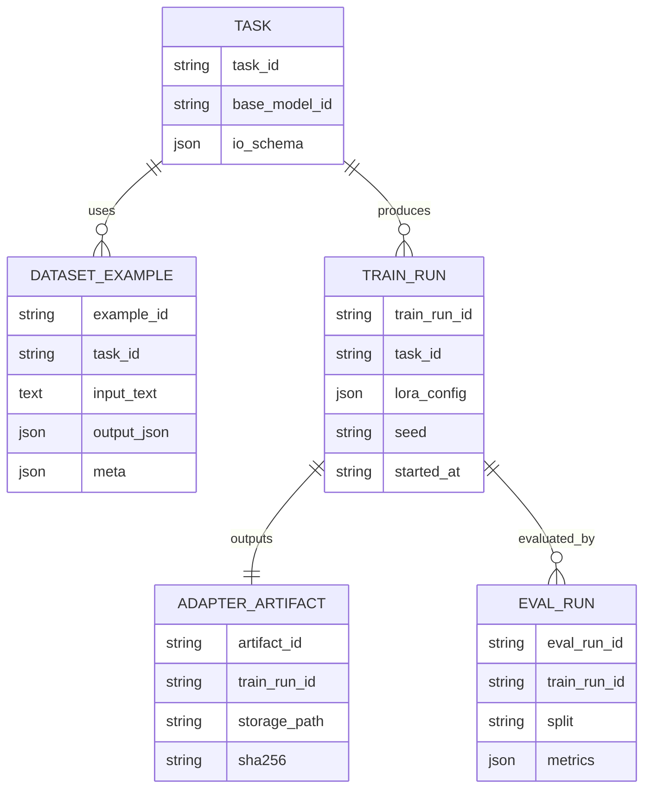
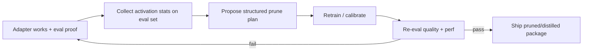

# HLD — PromptPrecision (Python-first)

## Goal (system contract)
Given a task definition (prompt + IO schema) and a small dataset, produce a **specialized small open-weight model package** (adapter now; pruning/distill later) and an **eval report** proving improvement.

---

## Architecture (MVP)
- **CLI-first** (Python) + optionally a small **Django** web UI later.
- Training stack: **HuggingFace Transformers** + **PEFT (LoRA)**.
- Eval stack: custom harness + JSON Schema validation + task metrics.
- Packaging: reproducible artifacts (adapter + lockfile + report).

### System overview (MVP)
```mermaid
flowchart TD
  U[User / team] -->|TaskSpec + Dataset| CLI[PromptPrecision CLI]

  CLI --> EVAL0[Baseline Eval]
  CLI --> TRAIN[Train Adapter (LoRA)]
  TRAIN --> ADAPT[Adapter Artifact]

  ADAPT --> EVAL1[Post-train Eval]
  EVAL0 --> REPORT[Eval report]
  EVAL1 --> REPORT

  CLI --> PACK[Packager]
  PACK --> PKG[Package: adapter + config + report + lock]

  PKG --> DEPLOY[Deploy: Ollama / vLLM / Transformers]
```

---

## Core components

### 1) TaskSpec (YAML/JSON)
**Purpose:** defines the task contract and how to score it.

Fields (v1):
- `base_model_id`
- `system_prompt` / `instruction_template`
- `io_schema` (JSON Schema)
- `label_enums` (for classification fields)
- `rubric` (how to judge correctness)
- `eval_split` (train/val/test strategy)



### 2) Dataset
**Format:** JSONL records.
- `{ input_text, output_json, meta }`
- Optional: `{input_text, output_json, negative_examples, source_id}`

### 3) Trainer
- Reads TaskSpec + train split
- Trains a LoRA adapter (rank/alpha/dropout)
- Deterministic seeds + version pinning

### 4) Evaluator
Scores both baseline and specialized adapter.

Metrics (MVP):
- JSON validity rate (schema)
- Per-field exact match / F1
- Enum confusion matrices
- Hallucination proxy (e.g., forbidden keys, out-of-enum values, extra entities)
- Latency benchmark (tokens/sec) on chosen hardware profile

### 5) Packager
Produces a reproducible deliverable:
- `adapter/` weights
- `task_spec.json`
- `eval_report.md`
- `repro.lock` (pip/uv/conda lock)

---

## Pipeline details

### End-to-end flow


### Data model (conceptual)


---

## Deployment targets (MVP)
- Local execution (developer laptop / small GPU box).
- Optional: produce an Ollama Modelfile or vLLM config bundle.

---

## Path to pruning (v2+)
We only ship pruning/distillation when it measurably improves both:
- **Quality** (task metrics)
- **Performance** (latency/VRAM)



---

## Risks & mitigations
- **Data scarcity** → ship data-collection workflow + synthetic generation + human review.
- **Overfitting** → strict held-out test set + leakage checks.
- **Benchmark gaming** → rubric must penalize invalid JSON, extra keys, and unsupported claims.
- **Misleading claims** → every export includes eval report and version pins.
